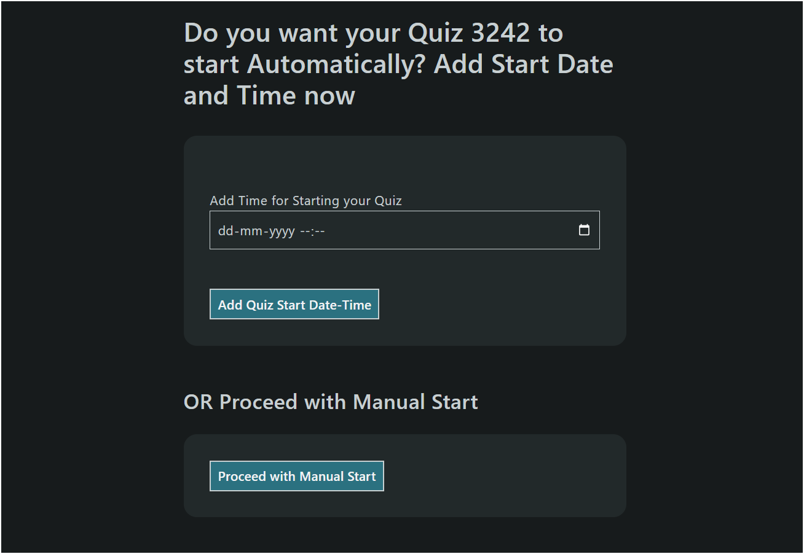

# Quiz App

This repo provides the code for the quiz app that I with my friends ([Ruchit Jagodara](https://github.com/ruchitjagodara), [Bhavik Patel](https://github.com/bp0609/), [Gaurav Budhwani](https://github.com/gaurav-budhwani)) under the guidance of [Prof. Balagopal Komarath](https://github.com/balu).

## Features

- The app contains all the basic features like login, signup, create quiz, show result, forget password etc.
- The app can be used as attendance taking device in the classroom as it has some security features like random number verification, and...(no, no, no that can not be disclosed here although you can find it in the code :wink:).
- The app is built using flask and sqlite3.
- The app can be safely hosted on any machine which has python installed (i.e. the app is lightweight).

## How to Use the App as Admin

First of all, you need to have to register yourself as an admin. For that, you need to run the add_admin.py file. The command to run the file is as follows: (Before running the command, make sure that you are in the root directory of the project)

```bash
python add_admin.py
```
Now, you can add/delete an admin. After adding an admin, you can run the app using the following command:

```bash
flask --app quiz_app run --host=<your_ip_address> --port=<port_number>
```
If you don't know your IP address then you can also run the app using the following command:

```bash
flask --app quiz_app run --host=0.0.0.0
```

If you want to run the app on debug mode then you can use --debug flag as follows:

```bash
flask --app quiz_app --debug run --host=0.0.0.0
```
You can also run the app on a specific port by using --port flag as follows:

```bash
flask --app quiz_app run --host=0.0.0.0 --port=5000
```

Now, you can see the web address where the app is running. You can open the web address in your browser and login as an admin.

> **_NOTE:_**  You will get two address, one of which will be localhost(127.0.0.1) and the other will be the IP address of the machine where the app is running. If your students/users are giving the quiz from different machines then you should use the IP address to access the app.

### Creating a Quiz

After login as admin you will see an interface like below.


You can create a quiz by clicking on the "Create Quiz" button. Now, you have to select an id and title for the quiz(quiz id should be unique but you can put same quiz name multiple times). Now, after creating the quiz you can add questions, options and can mark answers on the interface. 

Here, if you want to add a new question then you can click on the "Add Question" button. You can also delete a question by clicking on the "Delete Question" button. You can also add options to the question by clicking on the "Add Option" button. You can also delete an option by clicking on the "Remove" button. You can mark the answer by clicking on the check box which is located at the left side of "Remove" button, and in case of text type answers you can select question type as "text" and then you can write the answer in the text box provided (the answer will be case sensitive in case of text type answers). You can also write math equations in the input fields by using the latex syntax \$\$\<equation\>\$\$ for single line equations and \/\(\<equation\>\/\) for inline equations.

After adding all questions and answers the interface will look like below:


<!--  -->

Now, after adding all questions and answers you can click on the "Done" button to save the quiz.

>**_NOTE:_** Here, if you want you can put the time limit for every question but you can leave it as it is to put manual lock unlock option.

Then you will be redirected to a page like below:-


Here, you can set the start time and end time for the quiz or you have a option of manual start to start the quiz manually.

## How to Use the App as Student
First of all, you need to register yourself as a student. For that, you will be provided with a link by the admin. You can open the link in your browser and register yourself as a student. After registering yourself you can login as a student. After login, you will see the interface like below:


Here, you can enter the quiz code provided by the admin and then you can start the quiz. You have to first agree the terms and conditions and then select the verification number provided by the admin as shown in the image below:


And then you can start the quiz. You will see an interface like below:


Here, you can see the question is locked. Admin/Teacher can unlock the question and after he unlocks you have to click on the "next_question" button to refresh the page then you'll be able to see the question and options (in case of MCQ type question). You can select the answer and then click on the "Submit" button to submit the answer. If admin locks the question before you submit the question then your response will not be recorded. After attempting all the questions you can click on the "Submit Quiz" button to submit the quiz. 

After submitting the quiz you can see the results of the quiz. You can ee the correct answers and your responses.  You can also see the score any time later by entering the quiz code in the View Quiz Report

